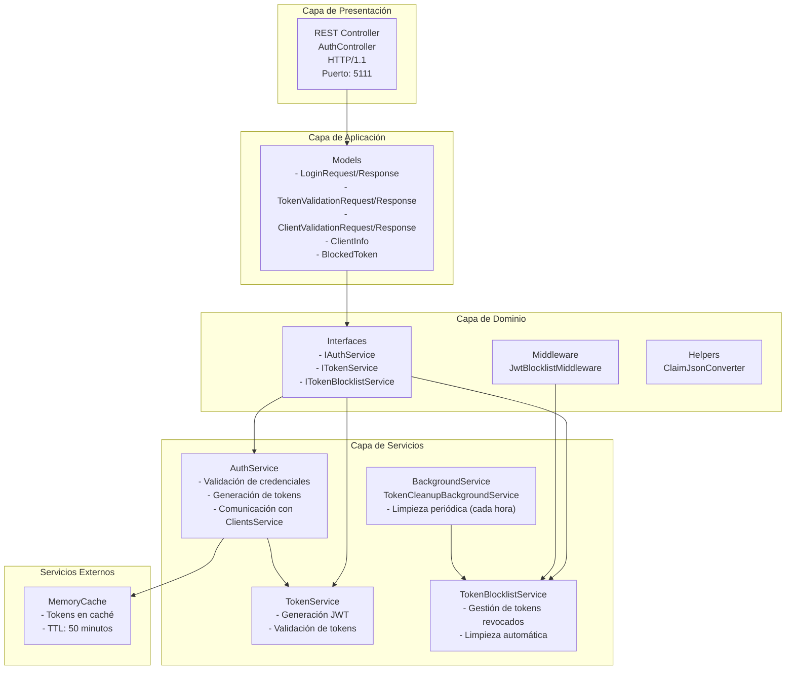

# censudex-auth-service

El Microservicio de Autenticación (AuthService) es responsable de gestionar la autenticación y autorización de usuarios dentro del ecosistema censudex. Este servicio actúa como intermediario entre el API Gateway y el servicio de clientes, generando y validando tokens JWT para acceso seguro a los recursos del sistema.

## Tecnologías utilizadas

- **Framework:** ASP.NET Core 9.0
- **Control de Versiones:** Git con Conventional Commits

## Patrón Arquitectónico Principal

El Microservicio de Autorización está construido siguiendo un patrón de Arquitectura en Capas y principios de Clean Architecture. Este microservicio es responsable de gestionar la autenticación de clientes, y validez de Tokens dentro del ecosistema censudex.



y se relaciona con la api gateway de la siguiente manera:

```
┌─────────┐         ┌──────────────┐         ┌──────────┐   
│ Client  │────────▶│ API Gateway  │────────▶│   Auth   │        
└─────────┘         │              │         │ Service  │         
                    │ 1. Check     │         │          │     
     Token          │    cache     │         │ Validate │
     ───────▶       │              │         │  Token   │
                    │ 2. Call      │────────▶│ Check    │
                    │    /validate │         │ Blocklist│
                    │              │◀────────│          │
                    │ 3. Forward   │         └──────────┘
                    │    to other  │────────────────────▶
                    │    Services  │         (if valid)
                    └──────────────┘
```


### Endpoint Disponibles

| Método | Endpoint | Request | Response | Descripción |
|--------|---------|----------|----------|-------------|
| `POST` | `login` | `LoginRequest`: {email, username, password} | `LoginResponse`: {client{}, token} | Permite el login de un usuario |
| `POST` | `logout` | `-` | { message: string } | invalida y añade el token del usuario a la blacklist  | 
| `Get`  | `validate-token` | `-` | `TokenValidationResponse`: {isValid, message, claim[]} | verifica la validez de un token | 

## Instalación y Configuración para entorno local

### Prerrequisitos

- **.NET 9 SDK:** [Download](https://dotnet.microsoft.com/download/dotnet/9.0)
- **Visual Studio Code o Visual Studio 2022:** [Download](https://code.visualstudio.com/)
- **Docker desktop** [Download for windows](https://docs.docker.com/desktop/setup/install/windows-install/)

### Pasos de Configuración
1.  **Clonar el Repositorio**:
    ```bash
    git clone https://github.com/Proyecto-Censudex-2025/censudex-auth-service.git
    cd censudex-auth-service
    cd AuthService
    ```
2. **Instalar Dependencias**
    ```bash
    dotnet restore
    ```
3. **Ejecutar el Proyecto**
    ```bash
    dotnet run
    ```
